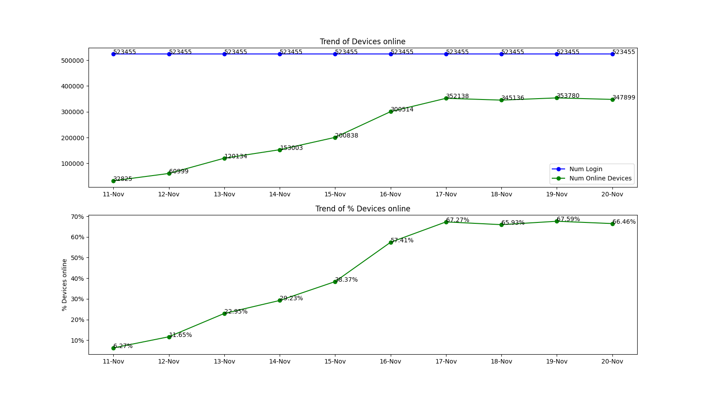

# demo_matplotlib
Demo of charts using matplotlib

## Pre-requisites
* Tested on MacOS with python3 installed

## Installation
* Clone repository to local machine
```
git clone git@github.com:JasonL888/demo_matplotlib.git
```

* create python virtual environment
```
cd demo_matplotlib
python3 -m venv ./venv
```

* access virtual environment
```
. ./venv/bin/activate
```

* install matplotlib (numpy gets installed as dependency)
```
pip install matplotlib
```

## Usage
```
python3 demo_chart.py
```
* Display on terminal
* Outputs to image file


## License
This project is licensed under MIT. Contributions to this project are accepted under the same license.
